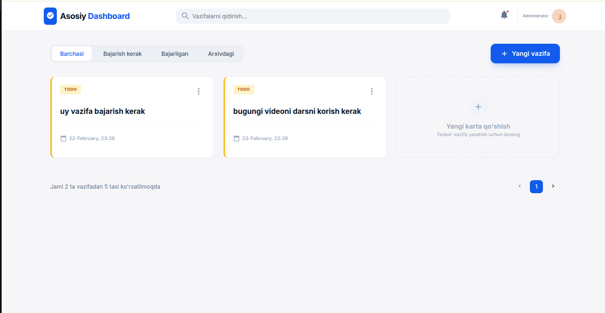
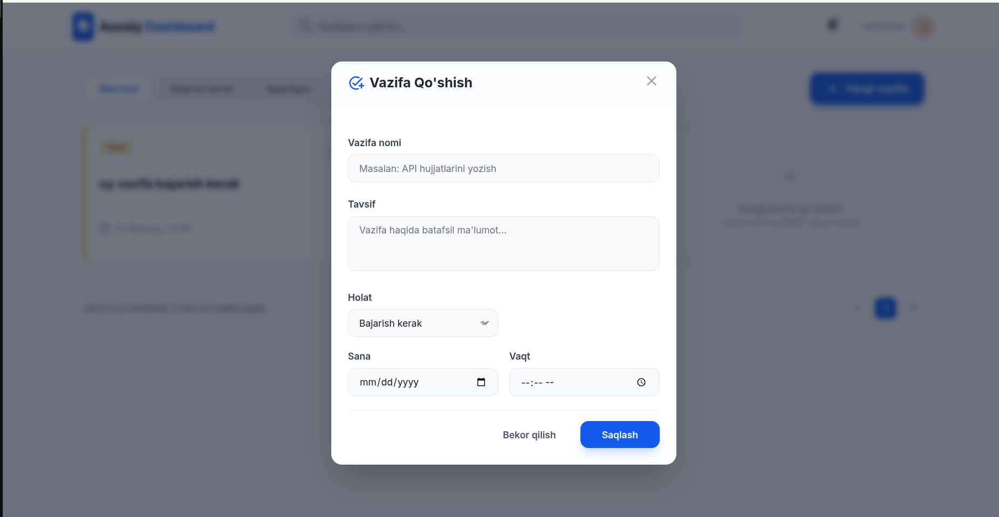

````markdown
# 📝 Django Todo Dashboard

Zamonaviy va responsiv **Todo Dashboard** loyihasi.  
Loyiha Django va TailwindCSS asosida qurilgan.

## 🚀 Imkoniyatlar

- ✅ Vazifa qo‘shish
- ✏️ Vazifani tahrirlash (Modal orqali)
- 🗂 Status bo‘yicha filterlash
- 📅 Sana va vaqt qo‘shish
- 📄 Pagination
- 🌙 Dark mode
- 🔐 Foydalanuvchi asosida vazifalarni ajratish

---

## 📸 Screenshotlar

### 🔹 Dashboard


### 🔹 Edit Modal


### 🔹 Dark Mode


---

# ⚙️ O‘rnatish bo‘yicha qo‘llanma

## 1️⃣ Loyihani yuklab olish

```bash
git clone https://github.com/your-username/your-repo-name.git
cd your-repo-name
````

---

## 2️⃣ Virtual Environment yaratish

Agar sizda `python` bo‘lsa:

```bash
python -m venv venv
```

Agar `python3` bo‘lsa:

```bash
python3 -m venv venv
```

---

## 3️⃣ Virtual environment ni yoqish

### 🐧 Linux / MacOS:

```bash
source venv/bin/activate
```

### 🪟 Windows:

```bash
venv\Scripts\activate
```

---

## 4️⃣ Django o‘rnatish

```bash
pip install django
```

Agar requirements.txt mavjud bo‘lsa:

```bash
pip install -r requirements.txt
```

---

## 5️⃣ Migratsiya qilish

```bash
python manage.py makemigrations
python manage.py migrate
```

---

## 6️⃣ Superuser yaratish (ixtiyoriy)

```bash
python manage.py createsuperuser
```

Username va parol kiriting.

---

## 7️⃣ Serverni ishga tushirish

```bash
python manage.py runserver
```

Brauzerda oching:

```
http://127.0.0.1:8000/
```

---

# 📂 Loyiha Strukturasi

```
project/
│
├── manage.py
├── db.sqlite3
├── requirements.txt
├── app/
│   ├── models.py
│   ├── views.py
│   ├── urls.py
│   └── templates/
│
└── static/
```

---

# 🧠 Ishlash Prinsipi

* Har bir foydalanuvchi o‘z vazifalarini ko‘radi
* Edit tugmasi modal ochadi
* Modal ichida ma'lumotlar avtomatik to‘ldiriladi
* Update POST request orqali amalga oshadi

---

# 🔐 Xavfsizlik

* CSRF himoyasi yoqilgan
* Faqat o‘z userining vazifasi update qilinadi

---

# 💡 Kelajak Rejalar

* 🔄 AJAX bilan refreshsiz update
* 📊 Statistik dashboard
* 🔔 Notification tizimi
* 📱 Mobil optimizatsiya

---

# 👨‍💻 Muallif

**Ziyodullo Aliyev**

Backend Developer | Django Developer

---

# ⭐ Agar loyiha yoqqan bo‘lsa

Repository ga ⭐ berishni unutmang!


